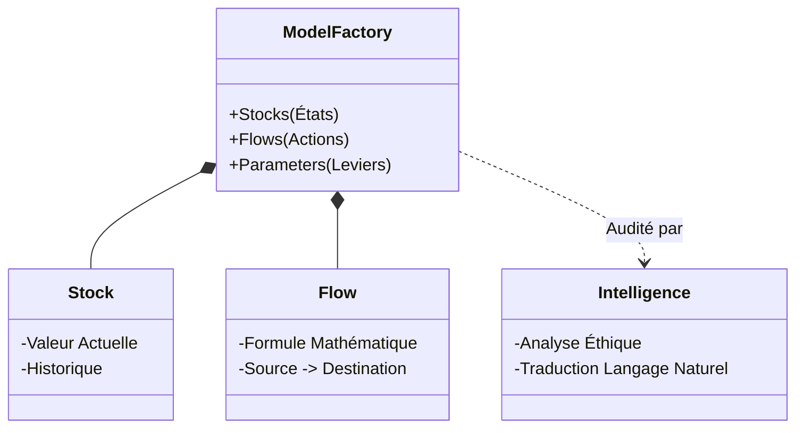

# 📘 Documentation Système : AeroDyn Model Factory

Ce document explique le fonctionnement du **Model Factory** de manière simple, claire et détaillée, pour comprendre la logique profonde sans être un expert technique.

---

## 0. L'Objectif du Système 🎯

**"Un Simulateur de Vol pour la Stratégie"**

Imaginez que vous pilotez un avion complexe (votre entreprise). Vous ne voulez pas tester une nouvelle manœuvre risquée en plein vol avec de vrais passagers.

Ce système est votre simulateur de vol. Il sert à :
1.  **Modéliser la réalité** : Créer une copie virtuelle de votre entreprise (réputation, contrats, capacités).
2.  **Tester le futur** : Si je change ma stratégie éthique aujourd'hui, que se passera-t-il dans 5 ans ? Faillite ou Succès ?
3.  **Voir l'invisible** : Comprendre les effets secondaires (les "boucles de rétroaction") que le cerveau humain a du mal à calculer.

---

## 1. La Structure des Données (La "Plomberie") 🔧

Tout le système repose sur une structure simple mais puissante. Imaginez un système de **réservoirs** et de **tuyaux**. C'est ce qu'on appelle la **Dynamique des Systèmes**.

Le fichier `model.json` contient cette structure. Voici les 4 éléments clés :

### A. Les Stocks (Les Réservoirs) 🛢️
C'est ce qui s'accumule. C'est l'état du système à un instant T.
*   *Exemple* : `reputation_capital` (Niveau de réputation), `ai_investment_fund` (Argent en banque).
*   *Analogie* : L'eau dans la baignoire.

### B. Les Flows (Les Tuyaux) 🚰
C'est ce qui fait monter ou descendre les réservoirs.
*   *Exemple* : `reputation_decay` (L'oubli, la perte de confiance), `capacity_expansion` (Nouvelles usines).
*   *Analogie* : Le débit du robinet (remplit) ou du siphon (vide).
*   *Formule* : Chaque tuyau a une "loi" mathématique (ex : "La peur grandit si on vend plus d'armes").

### C. Les Paramètres (Les Robinets) ⚙️
C'est ce que vous contrôlez. Ce sont les leviers du PDG.
*   *Exemple* : `ai_investment_rate` (Quel % du budget on met en R&D ?), `ethical_threshold` (Quelle est notre tolérance au risque ?).

### D. Les Boucles (Le Cercle Vicieux/Vertueux) 🔄
C'est la magie du système.
*   **Boucle de Renforcement (R)** : Plus j'ai de clients, plus j'ai d'argent, plus je fais de pub, plus j'ai de clients. (Effet Boule de Neige).
*   **Boucle d'Équilibrage (B)** : Plus je vends, plus le marché sature, moins je vends. (Effet Thermostat).

---

## 2. L'IA (Ollama) : Le Copilote Intelligent 🧠

L'IA n'est pas "magique", elle joue un rôle très précis d'architecte.

### À quoi a-t-elle accès ?
L'IA **NE VOIT PAS** le code du logiciel (Python). Elle voit uniquement le **Plan (JSON)**.
Elle lit : *"Il y a un réservoir 'Réputation' à 50% et un levier 'Investissement' à 10%."*

### Comment interagit-elle ?
1.  **L'utilisateur demande** : *"Ajoute une taxe de 10% sur les exports."*
2.  **L'IA traduit** : Elle comprend conceptuellement et écrit un petit bout de JSON :
    *   *"Créer un Flux 'taxe_export' qui vide le stock 'Revenus' avec la formule `Revenus * 0.10`."*
3.  **Le Système applique** : Le logiciel reçoit ce plan et "installe le tuyau" instantanément.

### Pourquoi c'est génial ?
L'IA ne peut pas "casser" le moteur. Elle ne fait que proposer des modifications au plan de la maison, que le moteur construit ensuite.

---

## 3. Pourquoi cette Structure ? (La Philosophie) 💡

Pourquoi ne pas avoir juste écrit du code "en dur" ?

1.  **Zéro Code Requis** : Pour changer la stratégie de l'entreprise, on change le fichier de données (JSON). On n'appelle pas le développeur.
2.  **Transparence Totale** : Rien n'est caché. Toutes les règles (les formules) sont lisibles et modifiables.
3.  **Auditabilité** : On peut prouver pourquoi le système a pris telle décision. "Regardez, c'est parce que le paramètre 'Éthique' était trop bas que la réputation a chuté."

---

## 4. Architecture et Flux du Projet 🏗️

Voici comment tout s'emboîte, du fichier texte à l'écran :

```mermaid
graph TD
    User((Utilisateur / PDG)) -->|1. Commandes / Clics| App[Interface Interface (Streamlit)]
    
    subgraph "Le Cerveau (Back-End)"
        ModelJSON[(Fichier model.json)] -->|Chargement| Engine[Moteur de Simulation (Python)]
        Engine -->|Calculs Mathématiques| Engine
    end
    
    subgraph "L'Intelligence (IA)"
        Prompt[Commande: 'Ajoute une taxe...'] -->|Envoi| Ollama[IA Locale (Ollama)]
        Ollama -->|Traduction structurelle| ModifJSON[Modification du JSON]
        ModifJSON -->|Mise à jour| ModelJSON
    end

    Engine -->|Données calculées| App
    App -->|Modification Paramètres| Engine
    
    style User fill:#f9f,stroke:#333,stroke-width:2px
    style App fill:#bbf,stroke:#333,stroke-width:2px
    style Engine fill:#dfd,stroke:#333,stroke-width:2px
    style ModelJSON fill:#ffd,stroke:#333,stroke-width:2px
```

### Le Flux d'Interaction
1.  **Lecture** : Le `Moteur` lit le `Fichier JSON`. Il comprend qu'il y a des réservoirs et des tuyaux.
2.  **Simulation** : Le moteur fait tourner le temps (Année 1, Année 2...). Il calcule les niveaux des réservoirs.
3.  **Affichage** : L' `Interface` montre les courbes.
4.  **Modification** :
    *   Soit vous touchez un curseur (Paramètre) -> Le moteur recalcule.
    *   Soit vous parlez à l'IA -> L'IA modifie le `Fichier JSON` -> Le moteur recharge le nouveau monde.

---

## 5. Résumé Visuel du Système



Ce système est vivant. Ce n'est pas juste un tableau Excel. C'est une **machine logique** qui vous permet de voir les conséquences de vos décisions avant qu'il ne soit trop tard.

---

## 6. Guide de Démarrage Rapide 🚀

Suivez ces étapes pour lancer le projet sur votre machine.

### Prérequis
-   **Python 3.8+** installé.
-   **Git** installé.
-   *(Optionnel)* **Ollama** pour les fonctionnalités d'IA générative.

### Installation

1.  **Cloner le dépôt :**
    ```bash
    git clone https://github.com/jeandirel/industrial_AI.git
    cd industrial_AI
    ```

2.  **Créer un environnement virtuel (recommandé) :**
    ```bash
    python -m venv venv
    # Windows
    .\venv\Scripts\activate
    # Mac/Linux
    source venv/bin/activate
    ```

3.  **Installer les dépendances :**
    ```bash
    pip install -r requirements.txt
    ```

### Lancer l'Application

Une fois installé, lancez simplement :
```bash
streamlit run app.py
```
L'interface s'ouvrira automatiquement dans votre navigateur.

### Configuration IA (Optionnel mais Recommandé) 🧠

Pour utiliser les commandes en langage naturel et l'audit éthique :

1.  Téléchargez et installez [Ollama](https://ollama.com).
2.  Téléchargez le modèle utilisé par le projet :
    ```bash
    ollama pull llama3.2:3b
    ```
3.  Assurez-vous qu'Ollama toure en arrière-plan (il se lance généralement tout seul, sinon lancez `ollama serve`).

---
